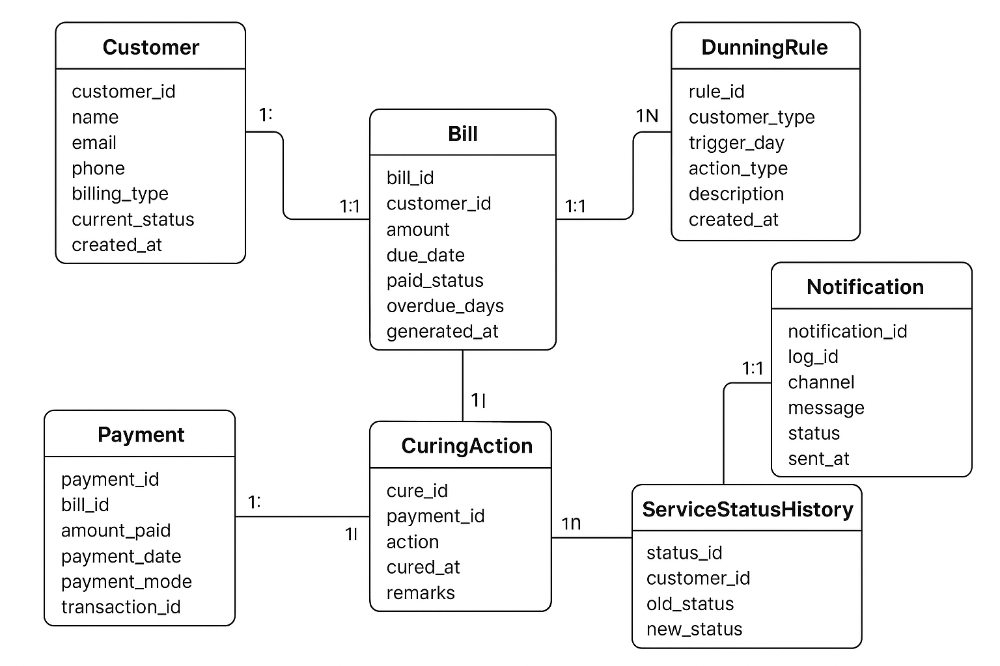

# Dunning & Curing System Documentation

## 1. Project Overview
The Dunning & Curing system handles overdue payments for prepaid and postpaid customers.  
It automates notifications, service restrictions, and service restoration after payment.

**Main Features:**
- Calculate overdue days for bills.
- Trigger actions based on Dunning rules (SMS, Email, Throttle, Bar, Reminder).
- Track all actions in Dunning logs and notifications.
- Restore service automatically on payment (Curing).


## 2. ER Diagram

### Entities
- Customer
- Bill
- Payment
- DunningRule
- DunningLog
- Notification
- CuringAction
- ServiceStatusHistory


## 2. ER Diagram




---

## 3. Database Schema (Summary)

### Customer
- customer_id (INT, PK)
- name (VARCHAR)
- email (VARCHAR)
- phone (VARCHAR)
- billing_type (ENUM: POSTPAID / PREPAID)
- current_status (ENUM: ACTIVE / THROTTLED / BARRED)
- created_at (DATETIME)

### Bill
- bill_id (INT, PK)
- customer_id (INT, FK)
- amount (DECIMAL)
- due_date (DATE)
- paid_status (ENUM: UNPAID / PAID / PARTIALLY_PAID)
- overdue_days (INT)
- generated_at (DATETIME)

### Payment
- payment_id (INT, PK)
- bill_id (INT, FK)
- amount_paid (DECIMAL)
- payment_date (DATETIME)
- payment_mode (ENUM: UPI / Card / NetBanking / Cash)
- transaction_id (VARCHAR)

### DunningRule
- rule_id (INT, PK)
- customer_type (ENUM: POSTPAID / PREPAID)
- trigger_day (INT)
- action_type (ENUM: SMS / Email / Throttle / Bar / Reminder)
- description (TEXT)
- created_at (DATETIME)

### DunningLog
- log_id (INT, PK)
- bill_id (INT, FK)
- rule_id (INT, FK)
- action_taken (VARCHAR)
- executed_at (DATETIME)

### Notification
- notification_id (INT, PK)
- log_id (INT, FK)
- channel (ENUM: SMS / Email / App)
- message (TEXT)
- status (ENUM: Sent / Failed)
- sent_at (DATETIME)

### CuringAction
- cure_id (INT, PK)
- payment_id (INT, FK)
- action (ENUM: Service Restored / Throttle Removed / Unbarred)
- cured_at (DATETIME)
- remarks (TEXT)

### ServiceStatusHistory
- status_id (INT, PK)
- customer_id (INT, FK)
- old_status (ENUM: ACTIVE / THROTTLED / BARRED)
- new_status (ENUM: ACTIVE / THROTTLED / BARRED)
- changed_at (DATETIME)
- reason (VARCHAR)

---

## 4. Spring Boot + MySQL Setup

- Dependencies:
  - Spring Web
  - Spring Data JPA
  - MySQL Driver
  - Lombok
  - DevTools

- `application.properties`:

```properties
spring.application.name=DunningAndCuring
server.port=9999
spring.datasource.url=jdbc:mysql://localhost:3306/dunningdb
spring.datasource.username=root
spring.datasource.password=root
spring.datasource.driver-class-name=com.mysql.cj.jdbc.Driver

spring.jpa.hibernate.ddl-auto=update
spring.jpa.show-sql=true
spring.jpa.properties.hibernate.dialect=org.hibernate.dialect.MySQL8Dialect

